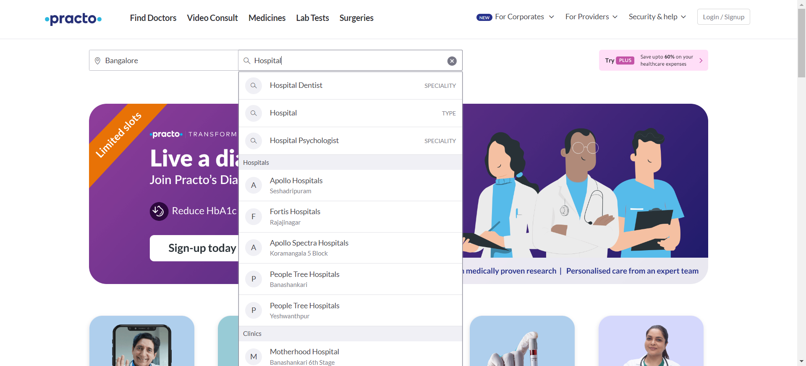
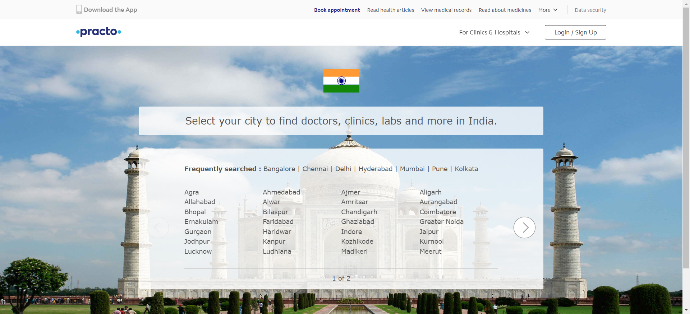

# Project README: Finding Hospitals

## Problem Statement

The **Finding Hospitals** project aims to automate the process of identifying hospitals in Bangalore city that meet specific criteria, such as being open 24/7, having parking facilities, and having a rating above 3.5. The project utilizes web scraping and automation techniques to extract and display the relevant hospital names from a designated website (Suggested Site: practo.com or any other legitimate site of choice).

<!-- Placeholder for an image related to problem statement -->

## Detailed Description

The project is part of a hackathon idea, and it focuses on automating the following tasks:

1. **Find Hospitals:** In Bangalore city, the automation script identifies hospitals that are open 24/7, have a rating above 3.5, and optionally have parking facilities. The names of these hospitals are extracted and displayed for the user.

<!-- Placeholder for an image related to finding hospitals -->

2. **Diagnostics Page:** The script navigates to the Diagnostics page and extracts the names of top cities, storing them in a list, and then displays this list.

<!-- Placeholder for an image related to diagnostics page -->

3. **Corporate Wellness:** The script interacts with the Corporate Wellness section, fills in invalid details, schedules an appointment, and captures the warning message that appears as an alert.

<!-- Placeholder for an image related to corporate wellness -->

**Suggested Site:** The hackathon suggests using "practo.com," but participants are free to choose any other legitimate website for data extraction and automation.

## Key Automation Scope

The project involves automation tasks that cover the following key aspects:

1. **Handling Alerts and Multiple Browser Windows:** The automation script is designed to handle alert messages that may appear during the web interactions. It can also manage different browser windows if required during the process.

2. **Navigation Control:** The script can navigate back to the home page or any other relevant sections as needed to perform the desired tasks.

3. **Data Extraction and Collection:** Multiple options and details are extracted from web pages, and the relevant information is collected and stored in appropriate data structures, such as lists or collections.

<!-- Placeholder for an image related to data extraction -->
Ratings_And_Open24hr/Wed_Jul_19_11_16_11_IST_2023.png)

4. **Filling Forms:** The automation script is capable of filling in forms on web pages, which is particularly useful when providing input data or scheduling appointments.

5. **Capture Warning Messages:** The script can effectively capture warning messages displayed as alerts during interactions with the website.

## Note

**Drivers:** The submitted zip file does not include the necessary browser drivers (e.g., Chrome driver and Edge driver) due to size constraints. To run the automation script successfully, you need to install the required drivers separately and include them in the data-driven framework.

**Instructions:** Make sure to follow the instructions provided to set up the necessary environment for running the automation script and ensure the drivers are properly configured.

## Getting Started

To get started with the project, follow these steps:

1. Set up the necessary environment and install the required browser drivers.
2. Clone or download the project repository from GitHub.
3. Open the project in your preferred Python environment.
4. Execute the automation script to start extracting hospital names, diagnostic data, and interacting with the Corporate Wellness section.

## Disclaimer

This project is developed as part of a hackathon and is intended for learning and demonstration purposes only. The use of web scraping and automation should comply with the website's terms of service and legal requirements. The developers are not responsible for any misuse of the provided code or its consequences.

## Contributions

Contributions to the project are welcome! If you would like to contribute, please follow these guidelines:

Fork the repository and create a new branch for your contribution.
Make your changes and ensure they adhere to the project's coding conventions.
Test your changes thoroughly to avoid any potential issues.
Submit a pull request with a clear description of the changes you've made.
Your contribution will be reviewed, and once approved, it will be merged into the main branch.
We appreciate any contributions, whether it's bug fixes, feature enhancements, or documentation improvements.
Feel free to contribute, modify, or enhance the project as per your requirements and creativity! Happy hacking!

## License

This project is released under the **Creative Commons Zero v1.0 Universal license**. By using or contributing to this project, you agree to comply with the terms and conditions of this license. For detailed information about the license, please refer to the **LICENSE** file in the project repository.
